# Azure VM Hardening Lab

CIS Level 1 hardening of a Linux and a Windows VM on Azure, provisioned with Terraform and deployed through a GitHub Actions CI/CD pipeline using OIDC federated authentication. Includes manual verification of every hardening control, a deliberate break-and-verify drift test, and least-privilege user creation on both operating systems.


---

## 📐 Architecture

.svg)

One resource group containing a VNet, an NSG restricted to inbound SSH (22) and RDP (3389) only, and two VMs — Ubuntu 22.04 and Windows Server 2022 — both hardened to CIS Level 1 on first boot. Infrastructure is provisioned by Terraform, deployed through GitHub Actions using OIDC federated credentials (no long-lived Azure secrets stored in GitHub).

---

## What This Project Does

- Deploys a Linux VM and a Windows VM into an isolated VNet using Terraform
- Applies CIS Level 1 hardening on first boot (Linux via `custom_data`, Windows via PowerShell)
- Configures SSH lockdown, PAM password complexity, auditd, and UFW on Linux
- Configures account lockout policy, password policy, firewall profiles, and audit logging on Windows
- Manually verifies every hardening control against its expected state
- Deliberately breaks a control (`PermitRootLogin`) and manually re-verifies it to confirm the checks actually catch non-compliance
- Creates least-privilege, non-admin users on both operating systems and proves the privilege boundary holds
- Deploys all infrastructure through a GitHub Actions CI/CD pipeline using OIDC — no long-lived Azure credentials stored in GitHub

---

## Tech Stack

| Category | Tools |
|---|---|
| IaC | Terraform, AzureRM Provider |
| Compute | Azure Linux VM (Ubuntu 22.04), Azure Windows VM (Server 2022) |
| Security / Compliance | CIS Level 1 Benchmark, auditd, PAM, UFW, AuditPol |
| CI/CD | GitHub Actions, OIDC federated credentials |
| Networking | Azure VNet, NSG |

---

## Repository Structure

```
.
├── .github/
│   └── workflows/
│       └── terraform-deploy.yml     # CI/CD pipeline (plan on PR, apply on merge)
├── main.tf
├── variables.tf
├── terraform.tfvars.example         # never commit real terraform.tfvars
├── docs/
│   ├── architecture-diagram.svg
│   └── screenshots/                 # all screenshots referenced below live here
└── README.md
```

> ⚠️ Add `terraform.tfvars` and `*.tfstate*` to `.gitignore` before pushing — the `admin_password` value lives in `terraform.tfvars` in this project.

---

## CI/CD Pipeline

Infrastructure is deployed through GitHub Actions rather than local `terraform apply`. The pipeline is split into two triggers so nothing gets applied to Azure without review:

- **On pull request →** CI runs automatically: `terraform init` → `terraform validate` → `terraform plan`. This gives a preview of exactly what will change, posted before anything is touched in Azure. Nothing is applied at this stage.
- **On merge to `main` →** the full pipeline runs end-to-end: it re-authenticates via OIDC and runs `terraform apply`, actually provisioning/updating the infrastructure.

```yaml
# .github/workflows/terraform-deploy.yml (abbreviated)
permissions:
  id-token: write
  contents: read

jobs:
  terraform:
    steps:
      - uses: azure/login@v2
        with:
          client-id: ${{ secrets.AZURE_CLIENT_ID }}
          tenant-id: ${{ secrets.AZURE_TENANT_ID }}
          subscription-id: ${{ secrets.AZURE_SUBSCRIPTION_ID }}
      - run: terraform init
      - run: terraform plan
      - run: terraform apply -auto-approve
```

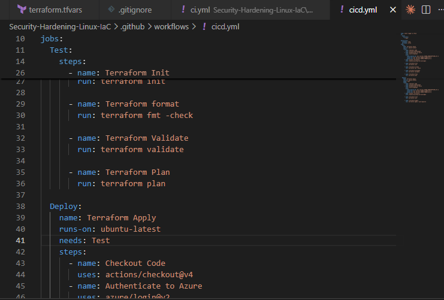

Opening a pull request kicks off the plan-only run — this is the review gate before anything touches Azure:

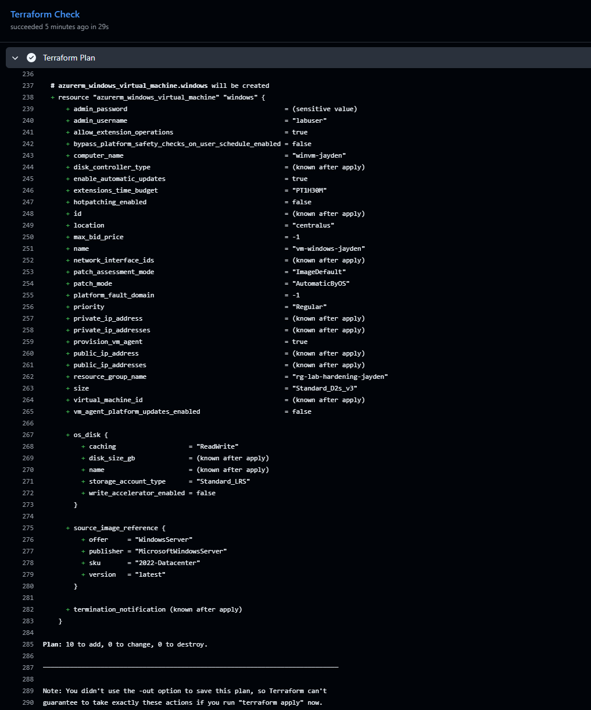

Merging to `main` triggers the full pipeline through `apply`:

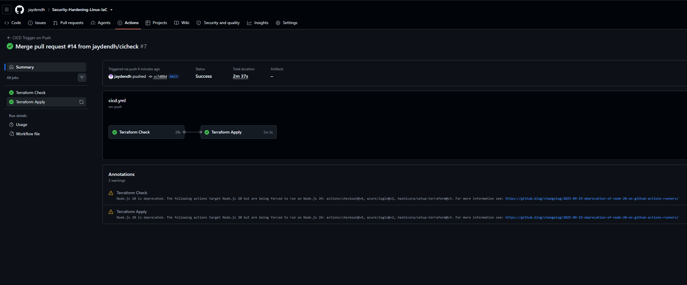

Authentication happens via OIDC — no client secret is stored in GitHub, only IDs, and the trust relationship is scoped to this repo:

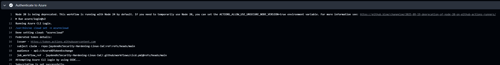

Plan and apply output from the pipeline logs:

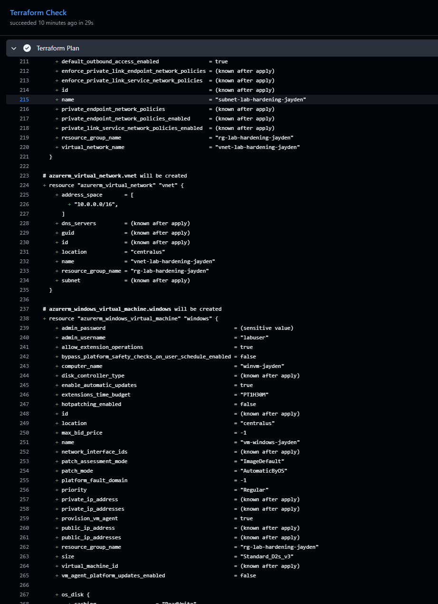
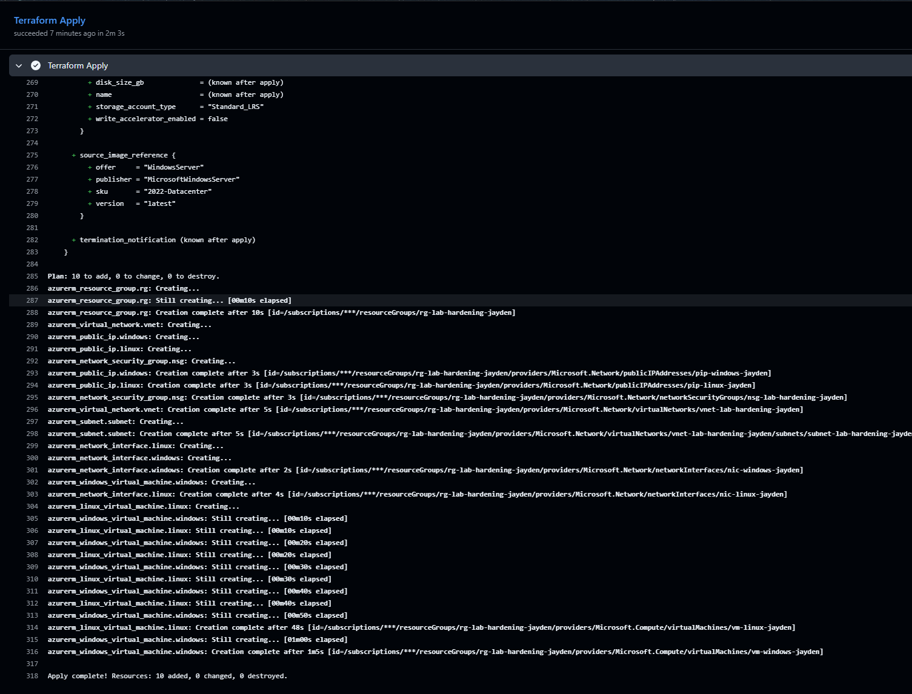

---

## Deployment

```bash
git clone <your-repo-url>
cd azure-vm-hardening-lab
cp terraform.tfvars.example terraform.tfvars   # fill in your own values
terraform init
terraform plan
terraform apply
```

Or simply push to `main` and let the pipeline handle it.

Once deployed, both VMs and the surrounding network are visible in the resource group:

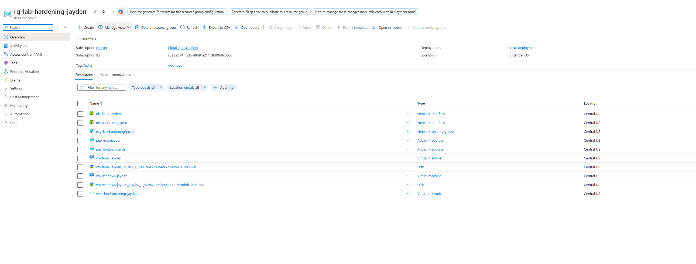

---

## Verification

### Linux Hardening

```bash
systemctl status auditd                              # active (running)
grep PermitRootLogin /etc/ssh/sshd_config             # PermitRootLogin no
sudo ufw status                                       # active, port 22 allowed
sudo modprobe cramfs 2>&1                             # ERROR: could not insert 'cramfs'
cat /etc/security/pwquality.conf | grep minlen         # minlen=14
```

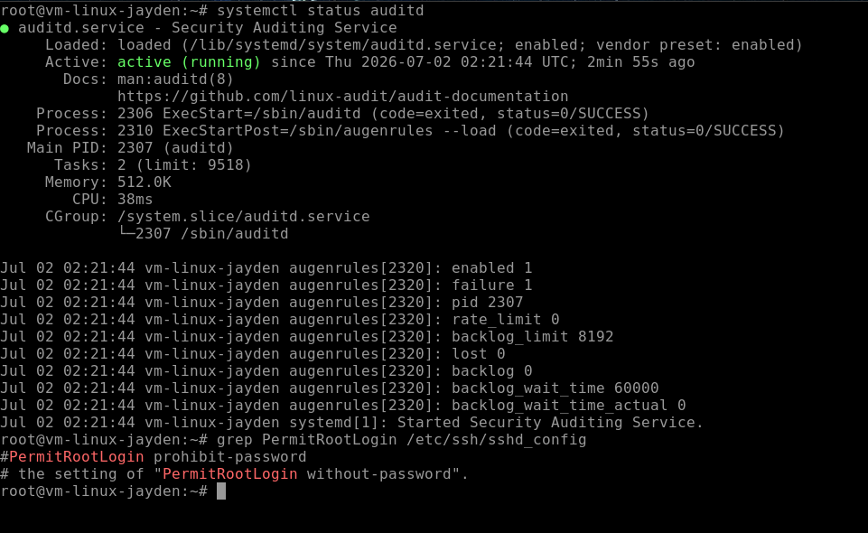

### Windows Hardening

Applied via PowerShell as Administrator:

```powershell
net accounts /lockoutthreshold:5 /lockoutduration:15 /lockoutwindow:15
net accounts /minpwlen:14 /maxpwage:60 /minpwage:1 /uniquepw:24
```

Verified with:

```powershell
net accounts
```

Expected output — lockout threshold 5, lockout/observation window 15 minutes, minimum password length 14, max age 60 days, min age 1 day, password history 24:

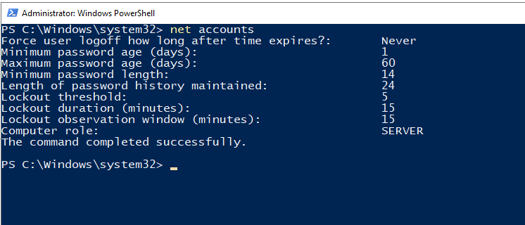

---

## Manual Drift Check

To prove the hardening controls are real and not just present in a config file, `PermitRootLogin` was deliberately re-enabled on the Linux VM to simulate configuration drift, then re-verified:

```bash
sudo sed -i 's/PermitRootLogin no/PermitRootLogin yes/' /etc/ssh/sshd_config
sudo systemctl restart sshd
grep PermitRootLogin /etc/ssh/sshd_config
```

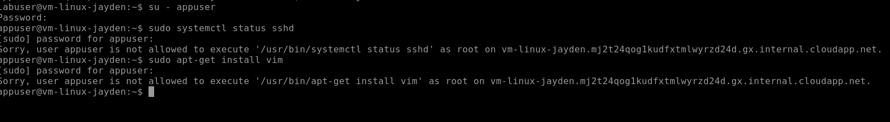

> **Note:** this project verifies drift manually via `grep`, not through Azure Policy Guest Configuration. Continuous policy-based compliance monitoring is a natural next step beyond this lab (see Lessons Learned).

---

## Least-Privilege Users

### Linux

Created a scoped service account limited to two specific commands rather than full sudo:

```bash
sudo useradd -r -s /bin/bash -m appuser
sudo passwd appuser
echo "appuser ALL=(ALL) NOPASSWD: /usr/bin/systemctl status, /usr/bin/journalctl" \
  | sudo tee /etc/sudoers.d/appuser
```

Proved the restriction holds — `appuser` can check service status but is denied package installation:

```bash
su - appuser
sudo systemctl status sshd     # allowed
sudo apt-get install vim       # denied
```


### Windows

Created a standard (non-admin) local user:

```powershell
$password = ConvertTo-SecureString "<your-password>" -AsPlainText -Force
New-LocalUser -Name "appuser" -Password $password -FullName "App Service User"
Add-LocalGroupMember -Group "Users" -Member "appuser"
```

Confirmed `appuser` is absent from the Administrators group:

```powershell
Get-LocalGroupMember -Group "Administrators"
```

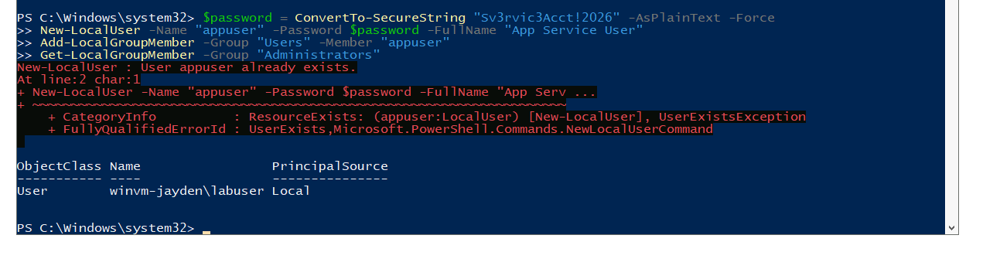

---

## Troubleshooting Notes

Issues actually hit while building this, kept here so future-me (or anyone else) doesn't lose time on them again.

**`sed` silently didn't match on Linux (`PermitRootLogin`).**
Ubuntu 22.04 ships `sshd_config` with `#PermitRootLogin prohibit-password` by default — commented out, and a different value than expected. A `sed` pattern written for `PermitRootLogin no` matches nothing against that line, so the replace is a no-op and `grep` shows the file unchanged. Fixed by matching the actual default line, or by deleting any existing `PermitRootLogin` line first and appending a fresh one:
```bash
sudo sed -i '/^#\?PermitRootLogin/d' /etc/ssh/sshd_config
echo "PermitRootLogin yes" | sudo tee -a /etc/ssh/sshd_config
sudo systemctl restart sshd
```

**Windows `New-LocalUser` rejected a password that met every stated complexity rule.**
The password contained a 3+ character substring that matched a token in the `-FullName` value (`"App Service User"` vs. a password starting with `User...`). Windows' password complexity check rejects passwords that echo part of the account's full name — this isn't surfaced clearly in the error text, which just says "does not meet the length, complexity, or history requirements." Fixed by using a password with no overlap with the full name, or by omitting `-FullName` entirely.

**Copy/paste not working through Azure Bastion (Developer SKU).**
Copy and paste is actually enabled by default on all Bastion SKUs, including Developer — the Configuration-page toggle only exists on Standard SKU or higher. When it doesn't work, the cause is almost always the browser: either the clipboard permission prompt was dismissed or missed when the session opened, or the browser doesn't support the Clipboard API and needs the manual clipboard tool palette (the two small arrows partway down the left edge of the session window) instead of OS-level keyboard shortcuts.

---

## CIS Controls Implemented

| Control | Linux | Windows |
|---|---|---|
| Disable unused filesystems/services | ✅ | — |
| Audit logging | ✅ auditd | ✅ AuditPol |
| SSH/RDP hardening | ✅ PermitRootLogin no | — |
| Password complexity | ✅ pwquality (14 char min) | ✅ net accounts (14 char min) |
| Account lockout | ✅ pam_faillock | ✅ 5 attempts / 15 min |
| Host firewall | ✅ UFW | ✅ all profiles enabled |
| Guest/unused account disabled | — | ✅ Guest disabled |
| Least-privilege user | ✅ scoped sudoers | ✅ standard Users group only |

---

## Lessons Learned

- OIDC federated auth removes the need to store an Azure client secret as a GitHub Actions secret — only IDs are stored, and the trust is scoped to the repo/branch.
- CIS hardening applied via `custom_data` only runs once, at first boot — it doesn't self-correct later drift. Manually confirming a broken control shows up on re-check reinforced why continuous compliance tooling (e.g. Azure Policy Guest Configuration, Automanage, or DSC) is a meaningful next step beyond one-time hardening.
- Default OS configuration doesn't always match what a hardening script assumes — verify the actual current state (`grep` the real line) before writing a targeted `sed`/replace, rather than assuming a known-good starting value.
- Windows password complexity checks against the account's other attributes (like `-FullName`), not just character-class rules — worth knowing before debugging a "meets requirements" password that still gets rejected.

---

## Teardown

```bash
terraform destroy
```

---

## Screenshots Checklist

All screenshots live in `docs/screenshots/`. Filenames match what's referenced throughout this README.

| # | Screenshot | Filename |
|---|---|---|
| 1 | Architecture diagram (SVG, in `docs/`, not `docs/screenshots/`) | `architecture-diagram.svg` |
| 2 | GitHub Actions workflow file open in editor (shows OIDC `permissions:` block) | `gh-actions-workflow-yaml.png` |
| 3 | Open pull request showing the `terraform plan` check running/passed | `gh-actions-pr-plan-check.png` |
| 4 | GitHub Actions Actions tab — full pipeline run triggered by merge to `main`, all steps green through `apply` | `gh-actions-run-success.png` |
| 5 | Expanded `azure/login` step in the Actions log showing OIDC auth succeeded (no secrets visible) | `gh-actions-oidc-login.png` |
| 6 | `terraform plan` output from the Actions log | `gh-actions-terraform-plan.png` |
| 7 | `terraform apply` output from the Actions log | `gh-actions-terraform-apply.png` |
| 8 | Azure Portal — Resource Group showing both VMs, VNet, NSG, public IPs | `azure-resource-group-overview.png` |
| 9 | Terminal — Linux hardening verification commands + expected output | `linux-hardening-verify.png` |
| 10 | Terminal/RDP — Windows `net accounts` output showing lockout/password policy | `windows-hardening-verify.png` |
| 11 | Terminal — `PermitRootLogin` broken then re-verified with `grep` | `linux-permitrootlogin-drift.png` |
| 12 | Terminal — `su - appuser` demo showing allowed vs. denied sudo command | `linux-least-privilege-user.png` |
| 13 | PowerShell — `Get-LocalGroupMember -Group "Administrators"` proving appuser is absent | `windows-least-privilege-user.png` |

**Tip:** crop out public IP addresses and any real password values before committing screenshots — even lab passwords shouldn't end up on GitHub.
